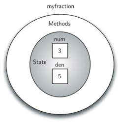

..  Copyright (C)  Brad Miller, David Ranum, and Jan Pearce
    This work is licensed under the Creative Commons Attribution-NonCommercial-ShareAlike 4.0 International License. To view a copy of this license, visit http://creativecommons.org/licenses/by-nc-sa/4.0/.

Object-Oriented Programming in C++: Defining Classes
~~~~~~~~~~~~~~~~~~~~~~~~~~~~~~~~~~~~~~~~~~~~~~~~~~~~

We stated earlier that C++ is an **object-oriented programming
language**. Object-oriented programming is a programming technique based on
real world things such as turtles, airplanes, customers, etc.
Each object has its own characteristics or attributes as well as its own set of behaviors.

So far, we have used a number of built-in classes to show
examples of data and control structures. One of the most powerful
features in an object-oriented programming language is the ability to
allow a programmer (problem solver) to create new classes that model
data that is needed to solve the problem.
Each **object** created with the class data type is called an **instance** of  the class.

Remember that we use abstract data types to provide the logical
description or blueprint for what a data object looks like (its state given by **object attributes**)
and what it can do (its behaviors given by **class methods**).
Defining a class creates the blueprint which defines the behaviors and attributes
of objects of that new data type.
By building a **class** that implements an abstract data
type, a programmer can take advantage of the abstraction process and at
the same time provide the details necessary to actually use the
abstraction in a program. Hence, whenever we want to implement an abstract data
type, we will do so with a new class which will provide the blueprint or template for
all of the objects of that type.

Four key principles are associated with object-oriented programming:

    1) abstraction
    2) encapsulation
    3) inheritance
    4) polymorphism

We will highlight each principle via examples.

A ``Fraction`` Class
^^^^^^^^^^^^^^^^^^^^

A very common example to show the details of implementing a user-defined
class is to construct a class to implement the abstract data type
``Fraction``. We have already seen that C++ provides a number of
numeric data types for our use. There are times, however, that it would be
most appropriate to be able to create data objects that both  look and act like
fractions.

A fraction such as :math:`\frac {3}{5}` consists of two parts. The top
value, known as the numerator, can be any integer. The bottom value,
called the denominator, can be any integer greater than 0 (negative
fractions have a negative numerator). Although it is possible to create
a floating point approximation for any fraction, we would
like to represent the fraction using exact values to avoid problems inherent
in approximations.

Since defining a class makes a new data type, the operations for the
``Fraction`` type will allow a ``Fraction`` data
object to behave like any other numeric type. We need to be able to
add, subtract, multiply, and divide fractions. We also want to be able
to print fractions using the standard “slash” form, for example 3/5. In
addition, all fraction methods should return results in their lowest
terms so that no matter what computation is performed, we always end up
with the most common form.

In C++, we define a new class by providing a name and a set of method
definitions that are syntactically similar to function definitions. For example:

.. tabbed:: class_creation

  .. tab:: C++

    .. code-block:: C++

         class Fraction {
             // The class methods and class variables go here
         };  // The ";" is required by C++ to end a class definition

    Creating a class in C++

  .. tab:: Python

    .. code-block:: Python

         class Fraction:

         #the methods go here

    Creating a class in Python

provides the framework for us to define the methods. The first method
that all classes should provide is the **constructor**.
The constructor
defines the way in which data objects are created.
It's considered good practice to have a constructor completely setup a class object,
so that it's impossible to create an object in an invalid state.
To create a
``Fraction`` object, we will need to initialize two pieces of data, the
numerator and the denominator. In C++, the constructor method is
always named with the same name as the class it creates
and is shown in :ref:`Listing 2 <lst_constructor>`.

.. _lst_constructor:

**Listing 2**

.. tabbed:: constructor

  .. tab:: C++

    .. code-block:: C++

        class Fraction {
            public:
              Fraction(int top, int bottom) {
                 /** Fraction contructor method */
                  num = top;     // setting num's value
                  den = bottom;  // setting den's value
                }
             private:
               int num; // num atribute
               int den; // den attribute
        };

    Creating a constructor in C++

  .. tab:: Python

    .. code-block:: Python

        class Fraction:

            def __init__(self,top,bottom):

                self.num = top
                self.den = bottom

    Creating a constructor in Python

As described earlier, fractions require
two pieces of state data, the numerator and the denominator. The
notation ``int num`` outside the constructor defines the ``fraction`` object
to have an internal data object called ``num`` as part of its state.
Likewise, ``int den`` creates the denominator. The values of the two
formal parameters are initially assigned to the state, allowing the new
``fraction`` object to know its starting values.

To create an object or instance of the ``Fraction`` class, we must invoke the
constructor. This happens by using the name of the class and passing
actual values for the necessary state after the variable name. For example,

.. tabbed:: InvokingConstructor

  .. tab:: C++

    .. code-block:: C++

        Fraction myfraction(3, 5);

    Invoking constructor in C++

  .. tab:: Python

    .. code-block:: Python

        myfraction = Fraction(3, 5)

    Invoking constructor in Python

creates an object called ``myfraction`` representing the fraction
:math:`\frac {3}{5}` (three-fifths). :ref:`Figure 5 <fig_fraction1cpp>` shows this
object as it is now implemented.

.. _fig_fraction1cpp:

   Figure 5: An instance of the ``Fraction`` Class

Abstraction and Encapsulation
^^^^^^^^^^^^^^^^^^^^^^^^^^^^^

Another way to think about fractions is as "parts of a whole" as shown in the
following figure:

    .. image:: Figures/fractions_partsofwhole.png

Since we are using classes to create abstract data types, we should probably discuss the meaning of
the word "abstract" in this context.
**Abstraction** in object-oriented programming requires you to focus only on the desired properties
and behaviors of the objects
and discard what is unimportant or irrelevant. Hence, if we do not need to think about
the "parts of a whole" metaphor, then we will not include it in the class. If that metaphor
is important, then we will include it. For our purposes, we want to think of
fractions as numbers, so we will not use the "parts of a whole" visual metaphor.

The object-oriented principle of **encapsulation** is the notion that we should
hide the contents of a class, except what is
absolutely necessary to expose.
Hence, we will restrict the access to our class as much
as we can, so that a user can change the class properties and behaviors only from methods
provided by the class.  C++ allows us to control access with the **access keywords** ``public`` and ``private``.
It is typical in C++ to make all data attributes ``private`` and most methods ``public``.
All attribute variables under the ``private``
keyword will only be able to be accessed by the object's class methods, not by the user.
Only C++'s '``public`` methods can be accessed and used by the user. Because we
want our user to be able to call every constructor directly, we always place the
constructor under ``public``. A third access keyword, ``protected`` will be discussed later.

.. dragndrop:: aande
    :feedback: Review the definitions of the key words.
    :match_1: Encapsulation|||A situation where bank software programmers want to protect users' personal information.
    :match_2: Abstraction|||A situation where software programmers want to develop similar objects without having to redefine the most similar properties.

    Match the corresponding key word to the appropriate scenario.

Polymorphism
^^^^^^^^^^^^

**Polymorphism** means the ability to appear in many forms. In object-oriented programming,
**polymorphism** refers to the ability to process objects or methods differently depending
on their data type, class, number of arguments, etc.
For example, we can overload a constructor with different numbers and types of arguments
to give us more optional ways to instantiate an object of the class in question.
For example,
we can add additional constructors to handle whole numbers and instances with no parameters given:

::

    Fraction(int top, int bottom){
        num = top;
        den = bottom;
    }
    Fraction (int top){
        num = top;
        den = 1;
    }
    Fraction (){
        num = 0;
        den = 1;
    }

Calling the constructor with two arguments will invoke the first method,
calling it with a single argument will invoke the second method, and calling
it with no arguments will invoke the third method.

Using optional parameters will accomplish the same task in this case.
Since the class will behave the same no matter which implementation
you use and the user will have no idea which implementation was chosen,
this is an example of encapsulation.

::

    Fraction(int top = 0, int bottom = 1){
        num = top;
        den = bottom;
    }

The next thing we need to do is implement some behaviors that the abstract
data type requires. To begin, let's consider what happens when we try to print
a ``Fraction`` object.

::

    int main() {
        Fraction myfraction(3, 5);

        // Throws an error
        cout << myfraction << endl;

        return 0;
    }

The ``fraction`` object, ``myfraction``, does not know how to respond to this
request to print to the console. The ``cout`` function requires that the object
knows how to interact with the ``<<`` operator so that the string can be sent to the
output stream. Without this, our class will throw an error, which is obviously not what we
want.

There are two ways we can solve this problem. One is to define a method
called something like ``show`` that will allow the ``Fraction`` object to print itself
as a string. We can implement this method as shown in
:ref:`Listing 3 <lst_showmethod>`. If we create a ``Fraction`` object as before, we
can ask it to show itself, in other words, print itself in the proper
format by invoking the show method on our fractions.

**Listing 3**

.. tabbed:: lst_showmethod

    .. tab:: C++

        .. activecode:: showmethod_cpp
            :language: cpp
            :caption: Show method implementation

            //using functions to print fractions to the command line.
            #include <iostream>
            using namespace std;

            class Fraction {
                public:
                    Fraction(int top = 0, int bottom = 1){
                        num = top;
                        den = bottom;
                    }

                    void show(){
                        cout << num << "/" << den << endl;
                    }
                private:
                    int num, den;
            };

            int main() {
                Fraction fraca(3, 5);
                Fraction fracb(3);
                Fraction fracc; //notice there are no parentheses here.
                // cout << fraca << endl; //uncomment to see error
                fraca.show();
                fracb.show();
                fracc.show();
                return 0;
            }

    .. tab:: Python

        .. code-block:: Python

            def show(self):
                print(self.num,"/",self.den)

The downside of this that it is not how we expect to print to the console.
In C++, there are many operators that are provided for atomic and STL data types
that may not work as expected with a user defined class until you **overload** them.
One of these, ``<<``, is the operator to
send data to the output stream.
It would be nicer to provide a “better” implementation for this method
via **operator overloading**.

Like function overloading, operator overloading allows us to make operators
work for user defined classes
by defining a special meaning for that operator when applied to objects
of the class as operands.

In C++ this new operator needs to be implemented as a **friend** of the class in order to
define the operator's behavior on objects of the class from a non-class method ``<<``.
Operator overloading is yet another example
of polymorphism in object-oriented programming.

A **friend function** of a class is a function defined outside that class' scope
but with the right to access
all private and protected members of the class.
In C++, we overload an operator by declaring it a **friend**
function in the class definition and giving it a new implementation.
:ref:`Listing 4 <lst_str>` shows an example of the ``<<`` operator being overloaded
in the ``Fraction`` class.
Note that stream operators
need to return the address of the stream because of the fact that the 
stream is changed by the stream operator.

**Listing 4**

.. tabbed:: overloading

    .. tab:: C++

        .. activecode:: overloaded_cpp
            :language: cpp
            :caption: An overloaded cout operator for the Fraction class

            /*overloading functions to take in different
            inputs and output the correct results*/
            #include <iostream>
            using namespace std;

            class Fraction {
                public:
                    Fraction(int top = 0, int bottom = 1){
                        num = top;
                        den = bottom;
                    }

                //the following tells the compiler to look for this friend's definition outside the class
                friend ostream &operator << (ostream &stream, const Fraction &frac);

                private:
                    int num, den;
            };

            ostream &operator << (ostream &stream, const Fraction &frac) {
                /** this is the definition. */
                stream << frac.num << "/" << frac.den;
                return stream;
            }

            int main() {
                Fraction myfraction(3, 5);
                cout << myfraction;

                return 0;
            }

    .. tab:: Python

        .. code-block:: Python

            def __str__(self):
                return str(self.num)+"/"+str(self.den)

                myf = Fraction(3,5)
                print(myf)
                print("I ate", myf, "of the pizza")

We can overload many other operators for our new ``Fraction`` class. Some
of the most important of these are the basic arithmetic operations. We
would like to be able to create two ``Fraction`` objects and then be able to add
them together using the standard “+” notation. At this point, if we try
to add two fractions using "+", we get the following:

.. tabbed:: frac_err

    .. tab:: C++

        .. code-block:: C++

            Fraction f1(1, 4);
            Fraction f2(1, 2);
            Fraction f3 = f1 + f2;

            // >> error: no match for ‘operator+’ (operand types are ‘Fraction’ and ‘Fraction’))

        An error received before overloading

    .. tab:: Python

        .. code-block:: Python

            f1 = Fraction(1,4)
            f2 = Fraction(1,2)
            f1+f2

            Traceback (most recent call last):
            File "<pyshell#173>", line 1, in -toplevel- f1+f2
            TypeError: unsupported operand type(s) for +: 'instance' and 'instance'

        An error received before overloading

If you look closely at the error, you see that the problem is that the
“+” operator does not understand the ``Fraction`` operands.

We can, of course create something like:

.. tabbed:: add_frac

    .. tab:: C++

        .. code-block:: C++

            f1.add(f2)

    .. tab:: Python

        .. code-block:: Python

            f1.__add__(f2)

which would ask the ``Fraction`` object ``f1`` to add the ``Fraction`` object
``f2`` to itself. It would be much better to be written in the standard notation,
``f1 + f2``. We can fix this by providing the ``Fraction`` class with a friend that
overloads the ``+``  operator.

As you know, two fractions must have the same denominator to be added. The easiest
way to make sure they have the same denominator is to simply use the
product of the two denominators as a common denominator so that
:math:`\frac {a}{b} + \frac {c}{d} = \frac {ad}{bd} + \frac {cb}{bd} = \frac{ad+cb}{bd}`
The implementation is shown in :ref:`Listing 5 <lst_addmethod>`. The addition
function returns a new ``Fraction`` object with the numerator and
denominator of the sum. We can use this method by writing a standard
arithmetic expression involving fractions, assigning the result of the
addition, and then printing our result.

.. _lst_addmethod:

**Listing 5**

.. tabbed:: frac_1

    .. tab:: C++

        .. code-block:: C++

                Fraction operator +(const Fraction &otherFrac){
                    //Note the return type is a Fraction
                    int newnum = num*otherFrac.den + den*otherFrac.num;
                    int newden = den*otherFrac.den;
                    return Fraction(newnum, newden);
                }

    .. tab:: Python

        .. code-block:: Python

                def __add__(self, otherfraction):

                    newnum = self.num*otherfraction.den + self.den*otherfraction.num
                    newden = self.den * otherfraction.den

                    return Fraction(newnum,newden)

.. tabbed:: frac_2

    .. tab:: C++

        .. activecode:: addfrac_cpp
            :language: cpp
            :caption: Addition overloaded for Fraction

            //using functions to abstract the idea of a fraction
            #include <iostream>
            using namespace std;

            class Fraction {
                public:
                    Fraction(int top = 0, int bottom = 1) {
                        num = top;
                        den = bottom;
                    }
                    Fraction operator +(const Fraction &otherFrac) {
                        int newnum = otherFrac.num*den + otherFrac.den*num;
                        int newden = den*otherFrac.den;
                        return Fraction(newnum, newden);
                    }

                friend ostream &operator << (ostream &stream, const Fraction &frac);

                private:
                    int num, den;
            };

            ostream &operator << (ostream &stream, const Fraction &frac) {
                stream << frac.num << "/" << frac.den;
                return stream;
            }

            int main(){
                Fraction f1(1, 4);
                Fraction f2(1, 2);
                Fraction f3 = f1 + f2;
                cout << f3 << " is "<< f1 << " + " << f2 << endl;
                return 0;
            }

    .. tab:: Python

        .. code-block:: Python

            f1=Fraction(1,4)
            f2=Fraction(1,2)
            f3=f1+f2
            print(f3)

The addition method works as we desire, but a couple of things
can be improved. When we use a binary operator like ``+`` we
like more symmetry.
A binary operator can be a member of the argument’s class if on 
the left side of the operator or a friend function.
Since the argument on the left side of the stream operator is a stream,
the stream operators will either have to be members of the stream class
or friend functions.
However, that is not true for ``+``.
Let's rewrite the addition operator as a friend function.

**Listing 6**

.. tabbed:: frac_friend

    .. tab:: C++

        .. code-block:: C++

                Fraction operator +(const &Fraction otherFrac){
                    //Note the return type is a Fraction
                    int newnum = num*otherFrac.den + den*otherFrac.num;
                    int newden = den*otherFrac.den;
                    return Fraction(newnum, newden);
                }

        Rewriting addition operator as a friend function

    .. tab:: Python

        .. code-block:: Python

                def __add__(self,otherfraction):
                    newnum = self.num*otherfraction.den + self.den*otherfraction.num
                    newden = self.den * otherfraction.den
                    return Fraction(newnum,newden)

.. activecode:: addfrac
  :language: cpp
  :caption: Addition overloaded for Fraction

  //overloading the addition operator to create clearer syntax
  #include <iostream>
  using namespace std;

  class Fraction {
      public:
          Fraction(int top = 0, int bottom = 1) {
              num = top;
              den = bottom;
          }

      friend ostream &operator << (ostream &stream, const Fraction &frac);
  		friend Fraction operator +(const Fraction &frac1, const Fraction &frac2);

      private:
          int num, den;
  };

  ostream &operator << (ostream &stream, const Fraction &frac) {
      stream << frac.num << "/" << frac.den;
      return stream;
  }

  Fraction operator +(const Fraction &frac1, const Fraction &frac2) {
  	int newnum = frac1.num * frac2.den + frac1.den * frac2.num;
  	int newden = frac1.den * frac2.den;
  	return Fraction(newnum, newden);
  }

  int main(){
      Fraction f1(1, 4);
      Fraction f2(1, 2);
      Fraction f3 = f1 + f2;
      cout << f3 << " is "<< f1 << " + " << f2 << endl;
      return 0;
  }

How you choose to overload operators  like ``+`` is a design choice
since both methods will work perfectly well. This is another
example of encapsulation; your user does not need to know
which you choose to use!

There is one more thing we can improve in our addition function.
Note that :math:`6/8` is the correct result
(:math:`\frac {1}{4} + \frac {1}{2}`) but that it is not in the
“lowest terms” representation. The best representation would be
:math:`3/4`. In order to be sure that our results are always in the
lowest terms, we need a helper function that knows how to reduce
fractions. This function will need to look for the greatest common
divisor, or GCD. We can then divide the numerator and the denominator by
the GCD and the result will be reduced to lowest terms.

The best-known algorithm for finding a greatest common divisor is
Euclid’s Algorithm, which will be discussed in detail in Chapter 8.
Euclid’s Algorithm states that the greatest common divisor of two
integers :math:`m` and :math:`n` is :math:`n` if :math:`n`
divides :math:`m` evenly. However, if :math:`n` does not divide
:math:`m` evenly, then the answer is the greatest common divisor of
:math:`n` and the remainder of :math:`m` divided by :math:`n`. We
will simply provide an iterative implementation here (see
:ref:`ActiveCode 1 <lst_gcd>`). Note that this implementation of the GCD algorithm only
works when the denominator is positive. This is acceptable for our
fraction class because we have said that a negative fraction will be
represented by a negative numerator.

.. _1st_gcd:

.. tabbed:: _lst_gcd

    .. tab:: C++

        .. activecode::  gcd_cpp
            :language: cpp
            :caption: The Greatest Common Divisor Function

            #include <iostream>
            using namespace std;

            int gcd(int m, int n) {
                while (m%n != 0) {
                    int oldm = m;
                    int oldn = n;

                    m = oldn;
                    n = oldm%oldn;
                }

                return n;
            }

            int main() {
                cout << gcd(20, 10) << endl;
                return 0;
            }

    .. tab:: Python

        .. activecode:: gcd_py
            :optional:

            def gcd(m,n):
                while m%n != 0:
                    oldm = m
                    oldn = n

                    m = oldn
                    n = oldm%oldn
                return n

            print(gcd(20,10))

Now we can use this function to help reduce any fraction. To put a
fraction in lowest terms, we will divide the numerator and the
denominator by their greatest common divisor. So, for the fraction
:math:`6/8`, the greatest common divisor is 2. Dividing the top and
the bottom by 2 creates a new fraction, :math:`3/4` (see
:ref:`Listing 6 <lst_newaddmethod>`).

.. _lst_newaddmethod:

**Listing 6**

.. activecode:: gcdadd
  :language: cpp
  :caption: Reduced fraction addition

  #include <iostream>
  using namespace std;

  int gcd(int m, int n){
      /** gcd is a helper function, used by but not part of the Fraction class */
      while (m%n != 0) {
          int oldm = m;
          int oldn = n;

          m = oldn;
          n = oldm%oldn;
      }
      return n;
  }

  class Fraction {
      public:
          Fraction(int top, int bottom) {
              num = top;
              den = bottom;
          }
          Fraction(int top){
              num = top;
              den = 1;
          }
          Fraction(){
              num = 1;
              den = 1;
          }
          Fraction operator +(Fraction otherFrac) {
              int newnum = num*otherFrac.den + den*otherFrac.num;
              int newden = den*otherFrac.den;
              int common = gcd(newnum, newden);
              return Fraction(newnum/common, newden/common);
          }

      friend ostream& operator << (ostream& stream, const Fraction& fraction);

      private:
          int num, den;
  };

  ostream & operator << (ostream& stream, const Fraction& fraction) {
      stream<<fraction.num<<"/"<<fraction.den;
      return stream;
  }

  int main(){
      Fraction f1(1, 4);
      Fraction f2(1, 2);
      Fraction f3 = f1 + f2;
      cout << f3 << " is "<< f1 << " + " << f2 << endl;
      return 0;
  }

.. _fig_fraction2cpp:

.. figure:: Figures/fraction2cpp.png
   :align: center

   Figure 6: An Instance of the ``Fraction`` Class with Two Methods

Our ``Fraction`` object now has two very useful methods and looks
like :ref:`Figure 6 <fig_fraction2cpp>`. An additional group of methods that we need to
include in our example ``Fraction`` class will allow two fractions to
compare themselves to one another using ``==``.

We want the ``==`` operator to compare Fraction objects and to return
``true`` if they are equivalent in value, ``false`` otherwise.
This is a design choice because we want :math:`\frac {1}{2}` to be considered
equal to :math:`\frac {2}{4}` as well as :math:`\frac {3}{6}`, etc.
Hence, in the ``Fraction`` class, we can implement the ``==`` method by
cross-multiplying (see :ref:`Listing 7 <lst_cmpmethod>`) rather than
by just comparing numerators and denominators.

Of course there are other relational operators that can be overridden. For example, the
``<=`` operator could be overridden to provide the less than or equal functionality.

.. _lst_cmpmethod:

**Listing 7**

.. tabbed:: overload

    .. tab:: C++

        .. code-block:: C++

            bool operator ==(Fraction &otherFrac) {
                int firstnum = num*otherFrac.den;
                int secondnum = otherFrac.num*den;

                return firstnum==secondnum;
            }

    .. tab:: Python

        .. code-block:: Python

            def __eq__(self, other):
                firstnum = self.num * other.den
                secondnum = other.num * self.den

                return firstnum == secondnum

The complete ``Fraction`` class, up to this point, is shown in
:ref:`ActiveCode 6 <lst_fractioncode>`. We leave the remaining arithmetic and relational
methods as exercises.

.. tabbed:: _lst_fractioncode

    .. tab:: C++

        .. activecode:: fraction_class_cpp
            :language: cpp
            :caption: The Fraction Class

            #include <iostream>
            using namespace std;

            int gcd(int m, int n) {
                while (m%n != 0) {
                    int oldm = m;
                    int oldn = n;

                    m = oldn;
                    n = oldm%oldn;
                }
                return n;
            }

            class Fraction {
                public:
                    Fraction(int top, int bottom) {
                        num = top;
                        den = bottom;
                    }
                    Fraction(int top){
                        num = top;
                        den = 1;
                    }
                    Fraction(){
                        num = 1;
                        den = 1;
                    }
                    Fraction operator +(Fraction otherFrac) {
                        int newnum = num*otherFrac.den + den*otherFrac.num;
                        int newden = den*otherFrac.den;
                        int common = gcd(newnum, newden);

                        return Fraction(newnum/common,newden/common);
                    }
                    bool operator ==(Fraction &otherFrac) {
                        int firstnum = num*otherFrac.den;
                        int secondnum = otherFrac.num*den;

                    }
                        return firstnum==secondnum;

                friend ostream& operator<<(ostream& stream, const Fraction& fraction);

                private:
                    int num, den;
            };

            ostream& operator << (ostream& stream, const Fraction& fraction) {
                stream << fraction.num << "/" << fraction.den;

                return stream;
            }

            int main(){
                Fraction x(1, 2);
                Fraction y(2, 4);
                cout << x << " + " << y << " = " << x+y << endl;
                if (x==y){
                    cout << "x is equal y" << endl;
                }
                else{
                    cout << "x is not equal y" << endl;
                }
                return 0;
            }

    .. tab:: Python

        .. activecode:: fraction_class_py
            :optional:

            def gcd(m,n):
                while m%n != 0:
                    oldm = m
                    oldn = n

                    m = oldn
                    n = oldm%oldn
                return n

            class Fraction:
                def __init__(self,top,bottom):
                    self.num = top
                    self.den = bottom

                def __str__(self):
                    return str(self.num)+"/"+str(self.den)

                def show(self):
                    print(self.num,"/",self.den)

                def __add__(self,otherfraction):
                    newnum = self.num*otherfraction.den + \
                                self.den*otherfraction.num
                    newden = self.den * otherfraction.den
                    common = gcd(newnum,newden)
                    return Fraction(newnum//common,newden//common)

                def __eq__(self, other):
                    firstnum = self.num * other.den
                    secondnum = other.num * self.den

                    return firstnum == secondnum

            x = Fraction(1,2)
            y = Fraction(2,3)
            print(x + y)
            print(x == y)

Self Check
^^^^^^^^^^

.. clickablearea:: class_syntax
    :question: Click on the line where there is a syntax error when defining the following class
    :iscode:
    :feedback: C++ class definitions end with a certain symbol

    :click-incorrect:class Fraction {:endclick:
      :click-incorrect:public::endclick:
          :click-incorrect:Fraction(int top, int bottom) {:endclick:
              :click-incorrect:/** Fraction contructor method */:endclick:
              :click-incorrect:num = top;     // setting num's value:endclick:
              :click-incorrect:den = bottom;  // setting den's value:endclick:
          :click-incorrect:}:endclick:
      :click-incorrect:private::endclick:
          :click-incorrect:int num; // num atribute:endclick:
          :click-incorrect:int den; // den attribute:endclick:
    :click-correct:}:endclick:

.. OOP class example:

**Question example**

.. highlight:: cpp
    :linenothreshold: 5

::

    #include<iostream>
    using namespace std;

    class Vehicle
    {

        protected:
            int wheels;
            int windows;
            int engine;
    };

    class Airplane: public Vehicle
    {
        protected:
            // wheels
            // windows
            // engine
            int wings;
    };

.. mchoice:: OOPclassquestion
    :answer_a: Inheritance
    :answer_b: Encapsulation
    :answer_c: Polymorphism
    :answer_d: Abstraction
    :correct: a
    :feedback_a: Correct! Airplane inherits many things from Vehicle
    :feedback_b: Encapsulation is the principle of hiding the contents of a class except when absolutely necessary. Wings is not hidden from Vehicle, it simply does not exist in the Vehicle class.
    :feedback_c: Polymorphism is the ability to process objects or methods differently depending on their data type, class, number of arguments, etc. A subclass using parts of a pre-existing class is not an example of polymorphism because they are used in the same way.
    :feedback_d: Abstraction is the principle of focusing on desired behaviors and properties while disregarding what is irrelevant/unimportant. Take another look at what the two classes have in common.

    Which OOP principle is the above code an example of?

.. dragndrop:: elements_of_OOP
    :feedback: Review the elements of object oriented programming
    :match_1: Encapsulation|||hiding the contents of a class except when absolutely necessary
    :match_2: Abstraction|||focusing on desired behaviors and properties while disregarding what is irrelevant/unimportant
    :match_3: Polymorphism|||processing objects or methods differently depending on their data type, class, number of arguments, etc.

    Drag the word on the left to its corresponding definition

.. dragndrop:: elements_of_classses
    :feedback: Review classes and their properties
    :match_4: instance|||an occurrence
    :match_5: constructor|||an special function to initialize
    :match_6: access keywords||| private and public
    :match_7: class|||a template for creating objects

    Drag the word on the left to its corresponding definition

To make sure you understand how operators are implemented in C++ classes, and how to properly write methods, write some methods to implement
:code:`*`, :code:`/`, and :code:`-`.  Also implement comparison operators :code:`>` and :code:`<`.

.. activecode:: self_check_4cpp
    :language: cpp
    :nocodelens:

    #include <iostream>
    using namespace std;

    int gcd(int m, int n) {
        while (m%n != 0) {
            int oldm = m;
            int oldn = n;

            m = oldn;
            n = oldm%oldn;
        }
        return n;
    }

    class Fraction {
        public:
            Fraction(int top, int bottom) {
                num = top;
                den = bottom;
            }
            Fraction(int top){
                num = top;
                den = 1;
            }
            Fraction(){
                num = 1;
                den = 1;
            }
            Fraction operator +(Fraction otherFrac) {
                int newnum = num*otherFrac.den + den*otherFrac.num;
                int newden = den*otherFrac.den;
                int common = gcd(newnum, newden);

                return Fraction(newnum/common,newden/common);
            }
            bool operator ==(Fraction &otherFrac) {
                int firstnum = num*otherFrac.den;
                int secondnum = otherFrac.num*den;

                return firstnum==secondnum;
            }

        friend ostream& operator<<(ostream& stream, const Fraction& fraction);

        private:
            int num, den;
    };

    ostream& operator << (ostream& stream, const Fraction& fraction) {
        stream << fraction.num << "/" << fraction.den;

        return stream;
    }

    int main(){
        Fraction x(1, 2);
        Fraction y(2, 4);
        cout << x << " + " << y << " = " << x+y << endl;
        if (x==y){
            cout << "x is equal y" << endl;
        }
        else{
            cout << "x is not equal y" << endl;
        }
        return 0;
    }

Our the next section will introduce another important aspect of
object-oriented programming, namely **inheritance**.
