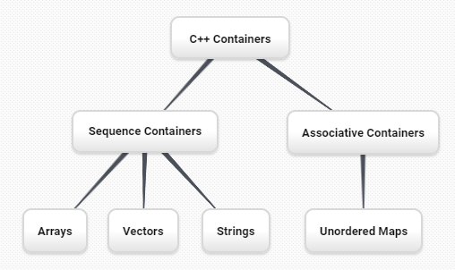

..  Copyright (C)  Brad Miller, David Ranum, and Jan Pearce
    This work is licensed under the Creative Commons Attribution-NonCommercial-ShareAlike 4.0 International License. To view a copy of this license, visit http://creativecommons.org/licenses/by-nc-sa/4.0/.

Inheritance: Logic Gates and Circuits
^^^^^^^^^^^^^^^^^^^^^^^^^^^^^^^^^^^^^

In this section we introduce another important aspect of
object-oriented programming. **Inheritance** is the ability for one
class to be related to another class in much the same way that people
can be related to one another. Children inherit characteristics from
their parents. Similarly, C++ child classes can inherit
characteristic data and/or behaviors from a parent class. These classes are
often referred to as **subclasses** and **base classes**.

:ref:`Figure 8 <fig_inherit1>` shows the built-in C++ collections and their
relationships to one another. We call a relationship structure such as
this an **inheritance hierarchy**. For example, the string is a child of
the sequential collection. In this case, we call the string the child and
the sequence the parent (or subclass string and superclass sequence). This
is often referred to as an ``IS-A Relationship`` (the string **IS-A**
sequential collection). This implies that strings inherit important
characteristics from sequences, namely the ordering of the underlying
data and operations such as concatenation, repetition, and indexing.

.. _fig_inherit1:

   Figure 8: An Inheritance Hierarchy for C++ Collections

Vectors, arrays, and strings are all types of sequential collections. They
all inherit common data organization and operations. However, each of
them is distinct as well. The children all gain from their parents
but distinguish themselves by adding additional characteristics.

By organizing classes in this hierarchical fashion, object-oriented
programming languages allow previously written code to be extended to
meet the needs of a new situation. In addition, by organizing data in
this hierarchical manner, we can better understand the relationships
that exist. We can be more efficient in building our abstract
representations.

To explore this idea further, we will construct a **simulation**, an
application to simulate digital circuits. The basic building block for
this simulation will be the logic gate. These electronic switches
represent boolean algebra relationships between their input and their
output. In general, gates have a single output line. The value of the
output is dependent on the values given on the input lines.

AND gates have two input lines, each of which can be either 0 or 1
(representing ``false`` or ``true``, repectively). If both of the input
lines have the value 1, the resulting output is 1. However, if either or
both of the input lines is 0, the result is 0. OR gates also have two
input lines and produce a 1 if one or both of the input values is a 1.
In the case where both input lines are 0, the result is 0.

NOT gates differ from the other two gates in that they only have a
single input line. The output value is simply the opposite of the input
value. If 0 appears on the input, 1 is produced on the output.
Similarly, 1 produces 0. :ref:`Figure 9 <fig_truthtable>` shows how each of these
gates is typically represented. Each gate also has a **truth table** of
values showing the input-to-output mapping that is performed by the
gate.

.. _fig_truthtable:

.. figure:: Figures/truthtable.png
   :align: center

   Figure 9: Three Types of Logic Gates

By combining these gates in various patterns and then applying a set of
input values, we can build circuits that have logical functions.
:ref:`Figure 10 <fig_circuit1>` shows a circuit consisting of two AND gates, one OR
gate, and a single NOT gate. The output lines from the two AND gates
feed directly into the OR gate, and the resulting output from the OR
gate is given to the NOT gate. If we apply a set of input values to the
four input lines (two for each AND gate), the values are processed and a
result appears at the output of the NOT gate. :ref:`Figure 10 <fig_circuit1>` also
shows an example with values.

.. _fig_circuit1:

.. figure:: Figures/circuit1.png
   :align: center

   Figure 10: Circuit

In order to implement a circuit, we will first build a representation
for logic gates. Logic gates are easily organized into a class
inheritance hierarchy as shown in :ref:`Figure 11 <fig_gates>`. At the top of the
hierarchy, the ``LogicGate`` class represents the most general
characteristics of logic gates: namely, a label for the gate and an
output line. The next level of subclasses breaks the logic gates into
two families, those that have one input line and those that have two.
Below that, the specific logic functions of each appear.

.. _fig_gates:

.. figure:: Figures/gates.png
   :align: center

   Figure 11: An Inheritance Hierarchy for Logic Gates

We can now start to implement the classes by starting with the most
general, ``LogicGate``. As noted earlier, each gate has a label for
identification and a single output line. In addition, we need methods to
allow a user of a gate to ask the gate for its label.

The other behavior that every logic gate needs is the ability to know
its output value. This will require that the gate perform the
appropriate logic based on the current input. In order to produce
output, the gate needs to know specifically what that logic is. This
means calling a method to perform the logic computation. The complete
class is shown in :ref:`Listing 8 <lst_logicgateclass>`.

.. _lst_logicgateclass:

**Listing 8**

.. sourcecode:: cpp

    class LogicGate {
        private:
          	string label;
          	bool output;

        public:
        	LogicGate(string n) {
          		label = n;
        	}

        	string getLabel() {
          		return label;
        	}

        	bool getOutput() {
          		output = performGateLogic();
          		return output;
    	    }
    };

At this point, we will not implement the ``performGateLogic`` function.
The reason for this is that we do not know how each gate will perform
its own logic operation. Those details will be included by each
individual gate that is added to the hierarchy. This is a very powerful
idea in object-oriented programming. We are writing a method that will
use code that does not exist yet. The parameter ``virtual`` is a reference
to the actual gate object invoking the method. Any new logic gate that
gets added to the hierarchy will simply need to implement the
``performGateLogic`` function and it will be used at the appropriate
time. Once done, the gate can provide its output value. This ability to
extend a hierarchy that currently exists and provide the specific
functions that the hierarchy needs to use the new class is extremely
important for reusing existing code.

We categorized the logic gates based on the number of input lines. The
AND gate has two input lines. The OR gate also has two input lines. NOT
gates have one input line. The ``BinaryGate`` class will be a subclass
of ``LogicGate`` and will add two input lines. The ``UnaryGate`` class
will also subclass ``LogicGate`` but will have only a single input line.
In computer circuit design, these lines are sometimes called “pins” so
we will use that terminology in our implementation.

.. _lst_binarygateclass:

**Listing 9**

.. sourcecode:: cpp

    class BinaryGate : public LogicGate {
        private:
            bool pinA;
            bool pinATaken;
            bool pinB;
            bool pinBTaken;

        public:
            BinaryGate(string n) : LogicGate(n) {
                pinATaken = false;
                pinBTaken = false;
            }

            bool getPinA() {
                if (pinATaken==false) {
                    cout << "Enter Pin input for gate " << getLabel() << " -->";
                    cin >> pinA;
                    pinATaken = true;
                }
                return pinA;
            }

            bool getPinB() {
                if (pinBTaken==false ) {
                    cout << "Enter Pin input for gate " << getLabel() << " -->";
                    cin >> pinB;
                    pinBTaken = true;
                }
                return pinB;
            }
    };

.. _lst_unarygateclass:

**Listing 10**

.. sourcecode:: cpp

    class UnaryGate : public LogicGate {
        private:
            bool pin;
            bool pinTaken;

        public:
            UnaryGate(string n) : LogicGate(n) {
                pinTaken = false;
            }

            bool getPin() {
                if (pinTaken==false) {
                    cout << "Enter Pin input for gate " << getLabel() << " -->";
                    cin >> pin;
                    pinTaken = true;
                }
                return pin;
            }
    };

:ref:`Listing 9 <lst_logicgateclass>` and :ref:`Listing 10 <lst_logicgateclass>` implement these two
classes. The constructors in both of these classes start with an
explicit call to the constructor of the parent class using the parent's name
method. When creating an instance of the ``BinaryGate`` class, we
first want to initialize any data items that are inherited from
``LogicGate``. In this case, that means the label for the gate. The
constructor then goes on to add the two input lines (``pinA`` and
``pinB``). This is a very common pattern that you should always use when
building class hierarchies. Child class constructors need to call parent
class constructors and then move on to their own distinguishing data.

A simple example of using a virtual function in C++ is shown below.

.. activecode:: virtualfunction
  :language: cpp
  :caption: Using a virtual function with inheritence

  #include <iostream>
  using namespace std;

  class Base {
      public:
      virtual void printType() {
          subfunction();
          cout << "I'm inherited!" << endl << endl;
      };

      virtual void subfunction() {};
  };

  class SubFirst : public Base {
      virtual void subfunction() {
          cout << "I'm one type of sub-class!" << endl;
      }
  };

  class SubSecond : public Base {
      virtual void subfunction() {
          cout << "I'm another type of sub class!" << endl;
      }
  };

  int main() {
      SubFirst first;
      first.printType();

      SubSecond second;
      second.printType();

      return 0;
  }

The only behavior that the ``BinaryGate`` class adds is the ability to
get the values from the two input lines. Since these values come from
some external place, we will simply ask the user via an input statement
to provide them. The same implementation occurs for the ``UnaryGate``
class except that there is only one input line.

Now that we have a general class for gates depending on the number of
input lines, we can build specific gates that have unique behavior. For
example, the ``AndGate`` class will be a subclass of ``BinaryGate``
since AND gates have two input lines. As before, the first line of the
constructor calls upon the parent class constructor (``BinaryGate``),
which in turn calls its parent class constructor (``LogicGate``). Note
that the ``AndGate`` class does not provide any new data since it
inherits two input lines, one output line, and a label.

.. _lst_andgateclass:

**Listing 11**

.. sourcecode:: cpp

    class AndGate : public BinaryGate {
        public:
            AndGate(string n) : BinaryGate(n) {};

            virtual bool performGateLogic() {
                bool a = getPinA();
                bool b = getPinB();
                if (a == 1 && b == 1) {
                    return true;
                }
                else {
                    return false;
                }
            }
    };

The only thing ``AndGate`` needs to add is the specific behavior that
performs the boolean operation that was described earlier. This is the
place where we can provide the ``performGateLogic`` method. For an AND
gate, this method first must get the two input values and then only
return 1 if both input values are 1. The complete class is shown in
:ref:`Listing 11 <lst_andgateclass>`.

We can show the ``AndGate`` class in action by creating an instance and
asking it to compute its output. The following session shows an
``AndGate`` object, ``g1``, that has an internal label ``"G1"``. When we
invoke the ``getOutput`` method, the object must first call its
``performGateLogic`` method which in turn queries the two input lines.
Once the values are provided, the correct output is shown.

::

   >>> AndGate g1("G1")
   >>> g1.getOutput()
   Enter Pin A input for gate G1-->1
   Enter Pin B input for gate G1-->0
   0

The same development can be done for OR gates and NOT gates. The
``OrGate`` class will also be a subclass of ``BinaryGate`` and the
``NotGate`` class will extend the ``UnaryGate`` class. Both of these
classes will need to provide their own ``performGateLogic`` functions,
as this is their specific behavior.

We can use a single gate by first constructing an instance of one of the
gate classes and then asking the gate for its output (which will in turn
need inputs to be provided). For example:

::

    >>> OrGate g2("G2")
    >>> g2.getOutput()
    Enter Pin A input for gate G2-->1
    Enter Pin B input for gate G2-->1
    1
    >>> g2.getOutput()
    Enter Pin A input for gate G2-->0
    Enter Pin B input for gate G2-->0
    0
    >>> NotGate g3("G3")
    >>> g3.getOutput()
    Enter Pin input for gate G3-->0
    1

Now that we have the basic gates working, we can turn our attention to
building circuits. In order to create a circuit, we need to connect
gates together, the output of one flowing into the input of another. To
do this, we will implement a new class called ``Connector``.

The ``Connector`` class will not reside in the gate hierarchy. It will,
however, use the gate hierarchy in that each connector will have two
gates, one on either end (see :ref:`Figure 12 <fig_connector>`). This relationship is
very important in object-oriented programming. It is called the **HAS-A
Relationship**. Recall earlier that we used the phrase “IS-A
Relationship” to say that a child class is related to a parent class,
for example ``UnaryGate`` IS-A ``LogicGate``.

.. _fig_connector:

.. figure:: Figures/connector.png
   :align: center

   Figure 12: A Connector Connects the Output of One Gate to the Input of Another

Now, with the ``Connector`` class, we say that a ``Connector`` HAS-A
``LogicGate`` meaning that connectors will have instances of the
``LogicGate`` class within them but are not part of the hierarchy. When
designing classes, it is very important to distinguish between those
that have the IS-A relationship (which requires inheritance) and those
that have HAS-A relationships (with no inheritance).

:ref:`Listing 12 <lst_Connectorclass>` shows the ``Connector`` class. The two gate
instances within each connector object will be referred to as the
``fromgate`` and the ``togate``, recognizing that data values will
“flow” from the output of one gate into an input line of the next. The
call to ``setNextPin`` is very important for making connections (see
:ref:`Listing 13 <lst_setpin>`). We need to add this method to our gate classes so
that each ``togate`` can choose the proper input line for the
connection.

.. _lst_Connectorclass:

**Listing 12**

.. sourcecode:: cpp

    class Connector {
        private:
        	LogicGate *fromgate;
        	LogicGate *togate;

        public:
        	Connector(LogicGate *fgate, LogicGate *tgate) {
        		fromgate = fgate;
        		togate = tgate;
        		tgate->setNextPin(fromgate->getOutput());
        	}

        	LogicGate *getFrom() {
        		return fromgate;
        	}

        	LogicGate *getTo() {
        		return togate;
        	}
    };

In the ``BinaryGate`` class, for gates with two possible input lines,
the connector must be connected to only one line. If both of them are
available, we will choose ``pinA`` by default. If ``pinA`` is already
connected, then we will choose ``pinB``. It is not possible to connect
to a gate with no available input lines.

.. _lst_setpin:

**Listing 13**

.. sourcecode:: cpp

    virtual void setNextPin(bool source) {
        if (pinATaken == false) {
            pinA = source;
            pinATaken=true;
            return;
        }
        else if (pinBTaken == false) {
            pinB = source;
            pinBTaken=true;
            return;
        }
        else {
            cout << "ERROR: ALL PINS TAKEN" << endl;
        }
    }

Now it is possible to get input from two places: externally, as before,
and from the output of a gate that is connected to that input line. This
requires a change to the ``getPinA`` and ``getPinB`` methods (see
:ref:`Listing 14 <lst_newgetpin>`). If the input line is not connected to anything
(``None``), then ask the user externally as before. However, if there is
a connection, the connection is accessed and ``fromgate``’s output value
is retrieved. This in turn causes that gate to process its logic. This
continues until all input is available and the final output value
becomes the required input for the gate in question. In a sense, the
circuit works backwards to find the input necessary to finally produce
output.

.. _lst_newgetpin:

**Listing 14**

.. sourcecode:: cpp

    bool getPinA() {
        if (pinATaken==false) {
            cout << "Enter Pin input for gate " << getLabel() << " -->";
            cin >> pinA;
            pinATaken = true;
        }
        return pinA;
    }

The following fragment constructs the circuit shown earlier in the
section:

::

    AndGate g1("AND1");
  	AndGate g2("AND2");
  	OrGate g3("OR3");
  	NotGate g4("NOT4");
  	Connector c1(&g1, &g2);
  	Connector c2(&g2, &g3);
  	Connector c3(&g3, &g4);

The outputs from the two AND gates (``g1`` and ``g2``) are connected to
the OR gate (``g3``) and that output is connected to the NOT gate
(``g4``). The output from the NOT gate is the output of the entire
circuit. For example:

::

    >>> g4.getOutput()
    Pin A input for gate G1-->0
    Pin B input for gate G1-->1
    Pin A input for gate G2-->1
    Pin B input for gate G2-->1
    0

Try it yourself using ActiveCode 4.

.. activecode:: complete_cuircuit
    :language: cpp
    :caption: The Complete Circuit Program.

    #include <iostream>
    #include <string>
    using namespace std;

    class LogicGate {
        private:
        	string label;
        	bool output;

        public:
        	LogicGate(string n) {
        		label = n;
        	}

        	string getLabel() {
        		return label;
        	}

        	bool getOutput() {
        		output = performGateLogic();
        		return output;
        	}

        	virtual bool performGateLogic() {
                cout << "ERROR! performGateLogic BASE" << endl;
                return false;
            };

        	virtual void setNextPin(bool source) {
                cout << "ERROR! setNextPin BASE" << endl;
            };
    };

    class BinaryGate : public LogicGate {
        private:
        	bool pinA;
        	bool pinATaken;
        	bool pinB;
        	bool pinBTaken;

        public:
        	BinaryGate(string n) : LogicGate(n) {
        		pinATaken = false;
        		pinBTaken = false;
        	}

        	bool getPinA() {
        	    if (pinATaken==false) {
            		cout << "Enter Pin A input for gate " << getLabel() << " -->";
            		cin >> pinA;
            		pinATaken = true;
        	    }
        		return pinA;
        	}

        	bool getPinB() {
                if (pinBTaken==false ) {
            		cout << "Enter Pin B input for gate " << getLabel() << " -->";
            		cin >> pinB;
            		pinBTaken = true;
                }
        		return pinB;
        	}

        	virtual void setNextPin(bool source) {
        		if (pinATaken == false) {
        			pinA = source;
        			this->pinATaken=true;
        		}
        		else if (pinBTaken == false) {
        			pinB = source;
        			this->pinBTaken=true;
        		}
        	}
    };

    class UnaryGate : public LogicGate {
        private:
        	bool pin;
        	bool pinTaken;

        public:
        	UnaryGate(string n) : LogicGate(n) {
        		pinTaken = false;
        	}

        	bool getPin() {
        	    if (pinTaken==false) {
            		cout << "Enter Pin input for gate " << getLabel() << " -->";
            		cin >> pin;
            		pinTaken = true;
        	    }
        		return pin;
        	}

        	virtual void setNextPin(bool source) {
        		if (pinTaken == false) {
        			pin = source;
        			pinTaken=true;
        		}
        		else {
        			return;
        		}
        	}
    };

    class AndGate : public BinaryGate {
        public:
        	AndGate(string n) : BinaryGate(n) {};

        	virtual bool performGateLogic() {
        		bool a = getPinA();
        		bool b = getPinB();
        		if (a == 1 && b == 1) {
        			return true;
        		}
        		else {
        			return false;
        		}
        	}
    };

    class OrGate : public BinaryGate {
        public:
        	OrGate(string n) : BinaryGate(n) {};

        	virtual bool performGateLogic() {
        		bool a = getPinA();
        		bool b = getPinB();
        		if (a == 1 || b == 1) {
        			return true;
        		}
        		else {
        			return false;
        		}
        	}
    };

    class NotGate : public UnaryGate {
        public:
        	NotGate(string n) : UnaryGate(n) {};

        	virtual bool performGateLogic() {
        		if (getPin()) {
        			return false;
        		}
        		else {
        			return true;
        		}
        	}
    };

    class Connector {
        private:
        	LogicGate *fromgate;
        	LogicGate *togate;

        public:
        	Connector(LogicGate *fgate, LogicGate *tgate) {
        		fromgate = fgate;
        		togate = tgate;
        		tgate->setNextPin(fromgate->getOutput());
        	}

        	LogicGate *getFrom() {
        		return fromgate;
        	}

        	LogicGate *getTo() {
        		return togate;
        	}
    };

    int main() {
    	AndGate g1("AND1");
    	AndGate g2("AND2");
    	OrGate g3("OR3");
    	NotGate g4("NOT4");

        // The inputs can be changed here!
        g1.setNextPin(1);
        g1.setNextPin(0);
        g2.setNextPin(1);
        g2.setNextPin(0);

    	Connector c1(&g1, &g3);
    	Connector c2(&g2, &g3);
    	Connector c3(&g3, &g4);

    	cout << g4.getOutput();

    	return 0;
    }

.. admonition:: Self  Check Challenge

    One of the fundamental building blocks of a computer is something called a flip flop.  It's not something that computer science professors wear on their feet, but rather a kind of circuit that is stable and stores the last piece of data that was put on it.  A simple flip-flop can be made from two NOR gates that are tied together as in the following diagram. See if you can implement this.

    .. image:: Figures/flipflop.png

    Note if the initial inputs to Reset and Set are both 0 then the output of the flip-flop is 0.  But if the Set input is toggled to 1 then the output becomes 1.  The great thing is that when the set input goes to 0 the output stays 1, until the reset input is toggled to 1 which resets the output of the circuit back to zero.
